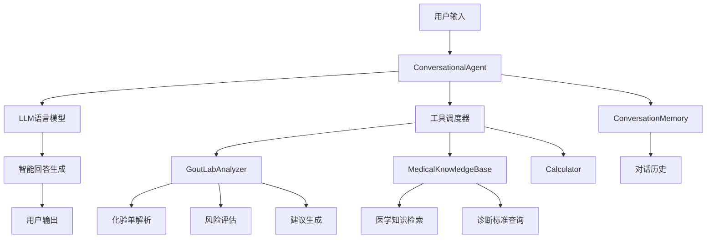

# 痛风化验单分析智能体架构设计

## 🏗️ 整体架构



## 📦 核心组件

### 1. GoutLabAnalyzer - 化验单分析工具

**功能职责:**
- 解析多种格式的化验单数据
- 识别尿酸、炎症指标、肾功能等关键参数
- 评估痛风风险等级（低、中、高）
- 生成个性化医学建议

**技术实现:**
```go
type GoutLabAnalyzer struct {
    CallbacksHandler callbacks.Handler
}

type LabResult struct {
    Parameter    string  // 检测项目
    Value        float64 // 检测值
    Unit         string  // 单位
    ReferenceMin float64 // 参考下限
    ReferenceMax float64 // 参考上限
    Status       string  // 正常/偏高/偏低
}
```

**核心算法:**
1. **数据解析**: 正则表达式匹配化验项目格式
2. **风险评估**: 多指标综合评估算法
3. **建议生成**: 基于指标异常程度的分层建议

### 2. MedicalKnowledgeBase - 医学知识库

**功能职责:**
- 存储痛风相关专业医学知识
- 提供疾病定义、症状、诊断标准
- 支持治疗方案和预防措施查询

**知识结构:**
```go
type MedicalInfo struct {
    Topic       string   // 主题
    Definition  string   // 定义
    Symptoms    []string // 症状
    Causes      []string // 病因
    RiskFactors []string // 危险因素
    Diagnosis   []string // 诊断标准
    Treatment   []string // 治疗方法
    Prevention  []string // 预防措施
    References  []string // 参考标准
}
```

**知识覆盖范围:**
- 痛风 (Gout)
- 高尿酸血症 (Hyperuricemia)
- 痛风性关节炎 (Gouty Arthritis)
- 痛风石 (Tophi)
- 炎症指标 (Inflammatory Markers)
- 肾功能 (Kidney Function)

### 3. ConversationalAgent - 对话智能体

**功能职责:**
- 协调各工具的调用
- 管理对话上下文和记忆
- 生成自然语言回答

**技术特性:**
- 基于 LangChain Go 框架
- 支持多轮对话记忆
- 智能工具选择和调度
- 自然语言理解和生成

## 🔄 工作流程

### 化验单分析流程
```
用户输入化验单数据
    ↓
智能体识别分析需求
    ↓
调用 GoutLabAnalyzer 工具
    ↓
解析化验数据 → 评估风险 → 生成建议
    ↓
LLM 整合分析结果
    ↓
生成专业医学报告
```

### 知识咨询流程  
```
用户提出医学问题
    ↓
智能体理解问题意图
    ↓
调用 MedicalKnowledgeBase 工具
    ↓
检索相关医学知识
    ↓
LLM 整合知识内容
    ↓
生成易懂的解答
```

## 🛡️ 设计模式

### 1. 策略模式 (Strategy Pattern)
- **应用**: 不同的风险评估算法
- **优势**: 算法可插拔，易于扩展

### 2. 工厂模式 (Factory Pattern)  
- **应用**: 创建不同类型的工具实例
- **优势**: 统一创建接口，降低耦合

### 3. 观察者模式 (Observer Pattern)
- **应用**: 回调处理机制
- **优势**: 事件驱动，监控工具执行

### 4. 模板方法模式 (Template Method)
- **应用**: 统一的分析流程框架
- **优势**: 流程标准化，实现差异化

## 🎯 关键技术决策

### 1. 数据解析策略
**决策**: 使用正则表达式进行灵活解析
**原因**: 
- 支持多种化验单格式
- 容错性好，适应性强
- 易于维护和扩展

### 2. 风险评估算法
**决策**: 多指标加权评估模型
**考虑因素**:
- 尿酸水平 (主要指标)
- 炎症反应 (急性期判断)
- 肾功能 (并发症评估)
- 综合风险分级

### 3. 知识存储方案
**决策**: 内存结构化存储
**原因**:
- 访问速度快
- 结构清晰
- 便于版本控制
- 适合静态医学知识

### 4. 对话记忆管理
**决策**: 使用 ConversationBuffer
**优势**:
- 保持会话上下文
- 支持连续问答
- 个性化交互体验

## 🚀 扩展性设计

### 1. 新指标支持
```go
// 在 parseLabInput 中添加新指标识别
if strings.Contains(parameterLower, "新指标") {
    // 新指标解析逻辑
}
```

### 2. 新疾病支持
```go
// 在 initializeKnowledge 中添加新疾病
mkb.knowledge["新疾病"] = MedicalInfo{
    // 疾病知识结构
}
```

### 3. 新工具集成
```go
// 实现 Tool 接口
type NewTool struct{}
func (t NewTool) Name() string { return "new_tool" }
func (t NewTool) Description() string { return "..." }
func (t NewTool) Call(ctx context.Context, input string) (string, error) {
    // 工具实现逻辑
}
```

## 📊 性能优化

### 1. 解析优化
- 预编译正则表达式
- 缓存常用解析结果
- 并行处理多项指标

### 2. 知识检索优化
- 建立索引映射
- 模糊匹配算法
- 结果缓存机制

### 3. 内存管理
- 控制对话历史长度
- 及时清理临时数据
- 优化数据结构

## 🔒 安全考虑

### 1. 数据隐私
- 不存储患者敏感信息
- 仅处理匿名化数据
- 遵循医疗数据保护规范

### 2. 输入验证
- 严格验证输入格式
- 防范恶意输入攻击
- 限制处理数据大小

### 3. 医疗免责
- 明确标识辅助性质
- 建议专业医生确认
- 不替代临床诊断

## 📈 未来发展方向

### 1. 功能增强
- 支持更多疾病类型
- 图像化验单识别
- 多语言支持

### 2. 智能化提升
- 机器学习风险预测
- 个性化建议生成
- 智能随访提醒

### 3. 集成扩展
- 医院信息系统集成
- 移动健康应用
- 云端服务部署

---

这个架构设计确保了系统的可扩展性、可维护性和专业性，为构建更复杂的医疗AI应用奠定了坚实基础。